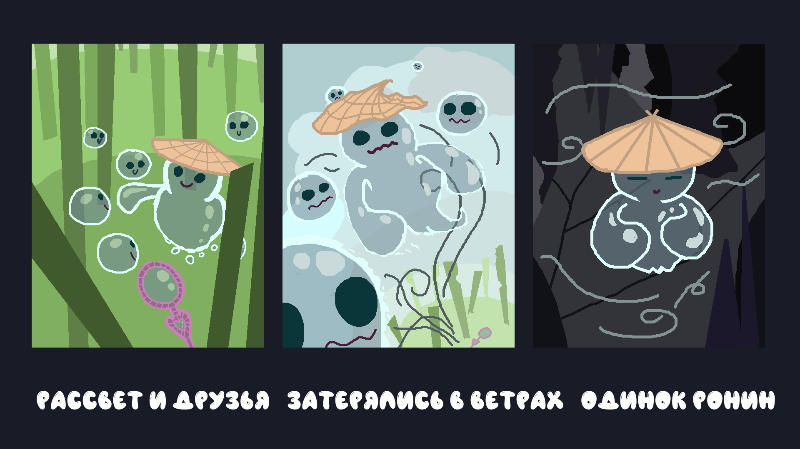
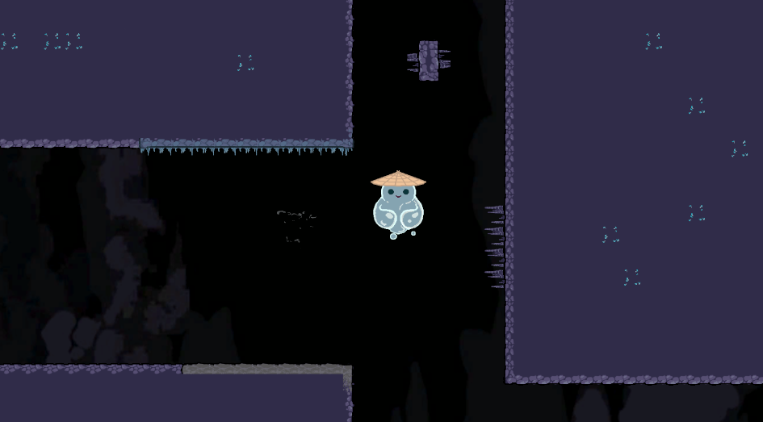
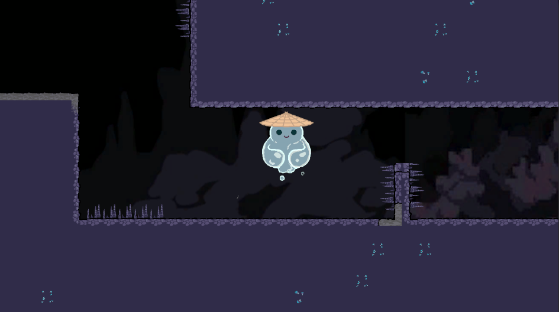

# The Bubblefly Effect

## Описание
"The Bubblefly Effect" – это атмосферная игра-приключение, где вы управляете хрупким пузырём, используя силу ветра. Заблудившись в глубинах пещер, вам предстоит исследовать извилистые лабиринты, преодолевать препятствия и решать головоломки, чтобы найти путь к свободе. Сможете ли вы помочь Кунилю выбраться?

## Установка
Скачайте архив со страницы релиза [здесь](https://github.com/MIDIFrogs/Bublik/releases/latest), распакуйте архив и запустите `exe`.

## Игровой процесс
Вам нужно направлять потоки ветра, чтобы главный герой перемещался через лабиринты. Цель игры – дойти до финиша и не столкнуться с препятствиями.

## Управление
Управление происходит через мышь: зажмите ЛКМ в месте начала и отпустите в месте конца, чтобы создать направленный поток ветра. В дальнейшем предполагается добавить мобильное управление.

## Команда
- Иван "@IOExcept10n" Олянишин – программист
- Максим "@jojer_m" Одинцов – программист
- Дмитрий "@Dexitti" Яковлев – художник, level-дизайнер
- Алексей "@TWorker" Жалий – UI/UX дизайнер, level-дизайнер
- Даниил "@klumbrik" Кудзоев – художник
- Роман "@rommiッ" Свиридов – музыкант

## Лицензия
MIT

## Скриншоты

## Контакты
Можете написать нам в телеграме [t.me/jojer_m](https://t.me/jojer_m).
